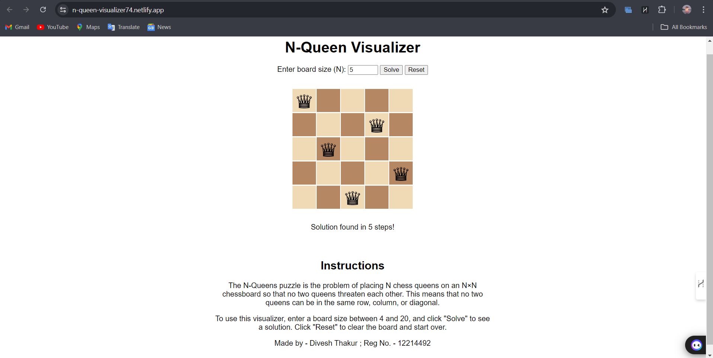

# N Queen Visualizer

This project is an interactive visualizer for the N Queen problem, implemented using HTML, CSS, and JavaScript. The N Queen problem is a classic combinatorial problem in which the goal is to place N chess queens on an N×N chessboard so that no two queens threaten each other. This visualizer allows users to see the Backtracking algorithm in action and understand how the problem is solved.

## Screenshot

## Live Site

Check out the live version of the project on Netlify:

[Live Demo](https://n-queen-visualizer74.netlify.app/)

